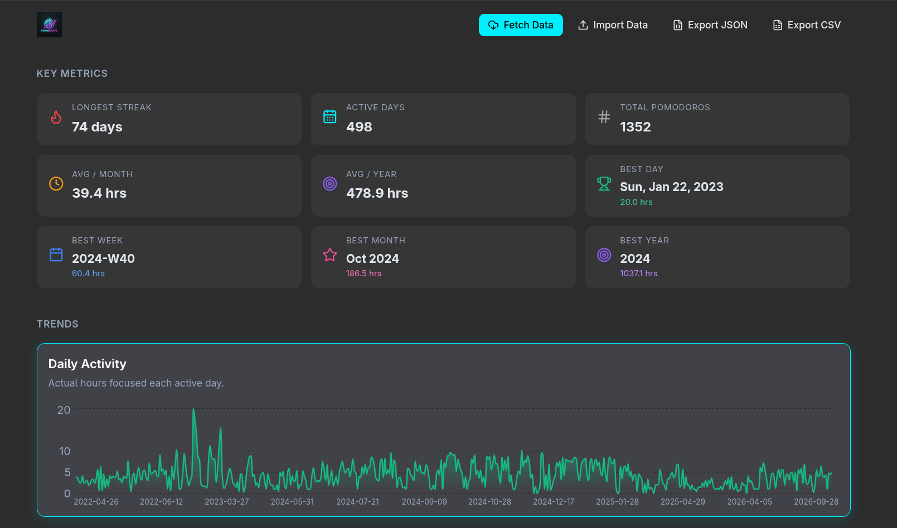
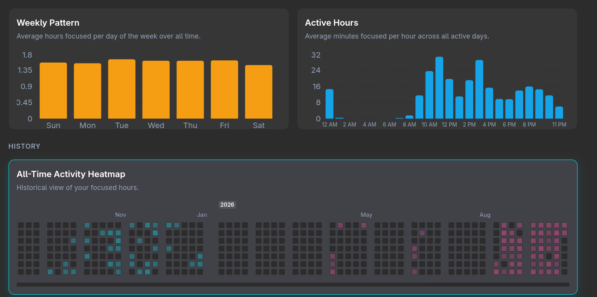
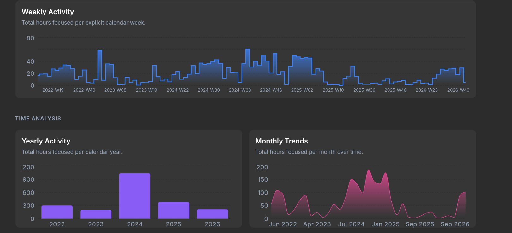

# 🍅 PomoStats

Welcome to **PomoStats**! The dashboard that helps you *ketchup* on your Pomodoro sessions and squeeze every last drop of productivity out of your day. If you've been working so hard that you feel like a crushed tomato, this visualizer will show you exactly where your time went!

## 📸 Sneak Peek

Here are some juicy details of the dashboard in action:

### Dashboard & Metrics


### Trends & Time Analysis


### All-Time Heatmap


## 🚀 Features
- **Key Metrics**: A sleek 3x3 grid showing off your longest streaks, total active days, and personal bests. 
- **Time Analysis**: Daily, weekly, monthly, and yearly chart breakdowns so you know exactly when you're most productive.
- **Heatmap History**: A gorgeous all-time heatmap to see your active days (and the days you just took a nap).
- **Turbo Fetching**: We fetch your data from Pomofocus with 10 concurrent threads. It's so fast it might break the space-time continuum!

## 🛠️ Setup & Run
Want to run it locally? It's easy peasy tomato squeezy.

```bash
npm install
npm run dev
```

Enjoy tracking your time, and remember: you're doing *grape*! 🍅
